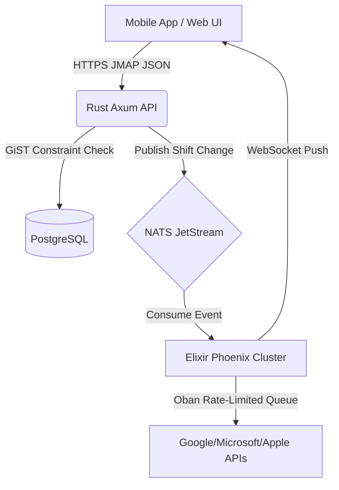

# Casin JMAP Server 🚀

[](LICENSE)
[](https://www.rust-lang.org/)
[](https://elixir-lang.org/)
[]()

> **Enterprise-grade workforce logistics and scheduling engine.** 
> Built by Fastcomcorp LLC, designed to securely manage and dispatch enterprise workforces at massive scale.

---

## 📖 Table of Contents
- [Why Casin?](#-why-casin)
- [Core Features](#-core-features)
- [The Split-Brain Architecture](#-the-split-brain-architecture)
- [Quick Start](#-quick-start)
- [Ports & Networking](#-ports--networking)
- [Documentation](#-documentation)
- [Security & Fuzz Testing](#-security--fuzz-testing)
- [License & Contributing](#-license--contributing)

---

## ⚡ Why Casin?
Traditional scheduling platforms often rely on synchronous HTTP polling, which can lead to severe performance bottlenecks during concurrency spikes—such as thousands of employees engaging in shift bidding simultaneously. 
**Casin JMAP Server** overcomes this scaling limitation by separating the mathematical scheduling logic from real-time communication using a modern **Split-Brain Architecture**. This event-driven approach provides strict immunity to double-booking and enables seamless, real-time schedule synchronization across highly distributed workforces.

## ✨ Core Features
* **Mathematical Double-Booking Protection:** Utilizes PostgreSQL GiST Range Types to physically prevent double-booking at the database level.
* **JMAP Native (RFC 8620):** Highly optimized JSON payloads reduce bandwidth by up to 80% compared to REST.
* **100% Market Sync Coverage:** Silently syncs shifts directly to employees' personal Apple iCloud, Google Workspace, and Microsoft 365 calendars.
* **ArcRTC Offline Sync:** If field workers lose cell service, schedules sync locally via encrypted WebRTC UDP mesh networks.
* **Massive Concurrency:** The Elixir cluster easily manages 300,000+ simultaneous WebSockets.

---

## 📡 ArcRTC: Offline Peer-to-Peer Mesh Sync
One of the most critical failures of legacy scheduling software is losing sync when field workers enter dead zones (e.g., hospital basements, rural logistics routes). Casin solves this using the proprietary **ArcRTC Protocol**.

If a worker loses cellular connection:
1. **Signaling:** Before losing service, the Elixir cluster provides WebRTC ICE candidates to all workers on the same shift.
2. **Mesh Network:** Devices automatically discover each other via Local Wi-Fi Direct or Bluetooth and form an encrypted UDP mesh network.
3. **Peer-to-Peer Sync:** Shift changes, clock-ins, and task completions are synced directly from phone-to-phone.
4. **Reconciliation:** The moment *any* single device in the mesh regains cellular service, it acts as a relay, pushing the entire mesh's state back to the Casin Server for PostgreSQL reconciliation.

---

## 🧠 The Split-Brain Architecture



1. **Rust (Axum)**: The Ironclad Gateway. Handles JMAP parsing, JWT authentication, and executes safe SQL queries.
2. **Elixir (Phoenix/Oban)**: The Realtime Router. Manages all WebSockets, WebPush notifications, and API syncs to external calendars.
3. **NATS JetStream**: The Firehose. Lightning-fast internal messaging connecting Rust and Elixir.

---

## 🚀 Quick Start
To boot the entire Casin stack for local development, ensure you have **Rust**, and **Elixir** installed.

```bash
# Clone the repository
git clone https://github.com/fastcomcorp/casin-jmap-server.git
cd casin-jmap-server

# Run the unified boot script
./start.sh
```
*The script will automatically boot the Rust and Elixir backends in the background and connect to your local PostgreSQL and NATS instances.*

---

## ⚙️ System Requirements
For production deployments, Casin requires the following minimum specifications and versions to handle the intended scale:

### Software Requirements
* **PostgreSQL:** `>= 15.0` (Required for advanced GiST Exclusion Constraint features)
* **NATS JetStream:** `>= 2.9.0` (Required for guaranteed delivery semantics)
* **Rust:** `>= 1.70`
* **Elixir:** `>= 1.15` (Erlang/OTP 25+)

### Minimum Hardware (Production Scale)
To support 10,000+ concurrent users with sub-millisecond response times, we recommend the following minimum hardware per node:
* **Rust API Gateway:** 2 vCPU, 4GB RAM
* **Elixir WebSocket Cluster:** 4 vCPU, 8GB RAM (Scales horizontally)
* **PostgreSQL Database:** 4 vCPU, 16GB RAM, SSD Storage (Critical for GiST index performance)

---

## 🌐 Ports & Networking
When deploying to AWS or configuring local firewalls, ensure the following ports are accounted for:

| Service | Port | Protocol | Scope | Description |
| :--- | :--- | :--- | :--- | :--- |
| **Rust Axum (JMAP)** | `3000` | TCP / HTTPS | **Public** | Main API Gateway for mobile apps (Requires JWT). |
| **Elixir Phoenix** | `4000` | TCP / WSS | **Public** | WebSocket secure connections for real-time sync. |
| **PostgreSQL** | `5432` | TCP | *Internal VPC* | Database storage and GiST logic. |
| **NATS JetStream** | `4222` | TCP | *Internal VPC* | Internal messaging firehose. |
| **Elixir libcluster**| `45892`| UDP Multicast| *Internal VPC* | Mesh networking protocol for Elixir nodes. |

> [!CAUTION]
> Never expose `4222`, `5432`, or `45892` to the public internet. They must remain isolated within your private cloud subnet.

---

## 🛡️ Security & Fuzz Testing
This server is mathematically hardened against Denial of Service (DoS) attacks.
* **Fuzz Tested:** The JSON parsers have been blasted with malformed data, deep-nesting bombs, and null-byte injections to mathematically prove they will not crash.
* **Erlang Atom Exhaustion:** The Elixir NATS consumer uses strict string-key parsing (`keys: :strings`) to prevent memory exhaustion attacks.
* **Encrypted in Transit:** All data hops mandate TLS 1.3, DTLS (for WebRTC), and strictly rotated OAuth 2.0 tokens.

---

## 📚 Documentation
Comprehensive documentation for developers and DevOps engineers can be found in the `docs/` directory:
* [Developer Handbook](docs/developer_handbook.md) - Architecture Overview & Troubleshooting.
* [ArcRTC Protocol](docs/arc_rtc_protocol.md) - WebRTC Offline Mesh Sync Specification.
* [Billion User Architecture](docs/billion_user_architecture.md) - Roadmap for Citus Sharding.

---

## ⚖️ License & Contributing

**Copyright (c) 2026 Fastcomcorp, LLC. All rights reserved.**

This project is open-source and licensed under the **GNU Affero General Public License v3.0 (AGPL-3.0)**. 
See the [LICENSE](LICENSE) file for the full legal text.

### Commercial Licensing
For enterprise usage without the AGPL v3 open-source restrictions, **Commercial Licenses are available.** If you wish to integrate the Casin JMAP Server into your proprietary backend without being forced to open-source your own code, please contact Fastcomcorp, LLC for commercial pricing.

### Contributing & CLA Requirement
We welcome community contributions! However, to protect the intellectual property of this project, all contributors must sign a **Contributor License Agreement (CLA)** before any code can be accepted or merged. Please see [CONTRIBUTING.md](CONTRIBUTING.md) for details.

---

## 🙏 Acknowledgements & Open Source Credits
The Casin JMAP Server stands on the shoulders of giants. We would like to extend our deepest gratitude to the open-source community and the maintainers of the following critical libraries that made this project possible.

### Rust Ecosystem
* **[Tokio](https://tokio.rs/)**: The asynchronous runtime that powers our extreme concurrency.
* **[Axum](https://github.com/tokio-rs/axum)**: The ergonomic and lightning-fast web framework routing our JMAP payloads.
* **[SQLx](https://github.com/launchbadge/sqlx)**: For compile-time checked, asynchronous PostgreSQL database access.
* **[async-nats](https://github.com/nats-io/nats.rs)**: The official NATS client for Rust, enabling our split-brain architecture.

### Elixir & Erlang Ecosystem
* **[Phoenix Framework](https://www.phoenixframework.org/)**: The unparalleled web framework managing our WebSocket infrastructure.
* **[Oban](https://getoban.pro/)**: The robust job processing queue ensuring our Google/Microsoft/Apple API syncs are strictly rate-limited and never lost.
* **[libcluster](https://github.com/bitwalker/libcluster)**: The backbone of our distributed Elixir node mesh network.
* **[Gnat](https://github.com/nats-io/gnat)**: The high-performance NATS client for Elixir.
